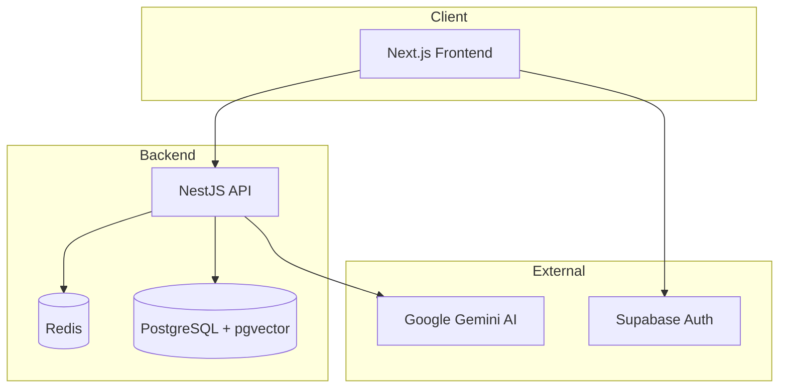
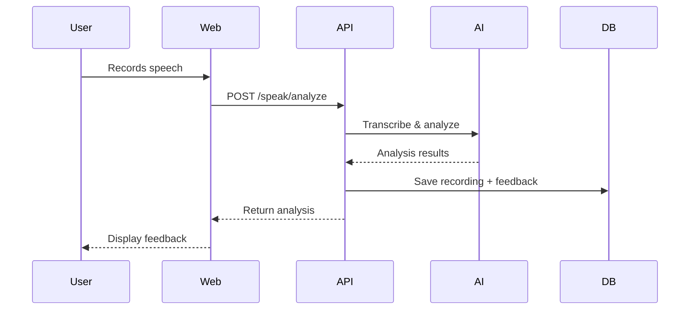
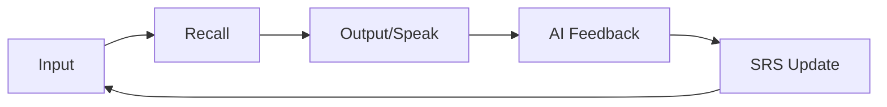
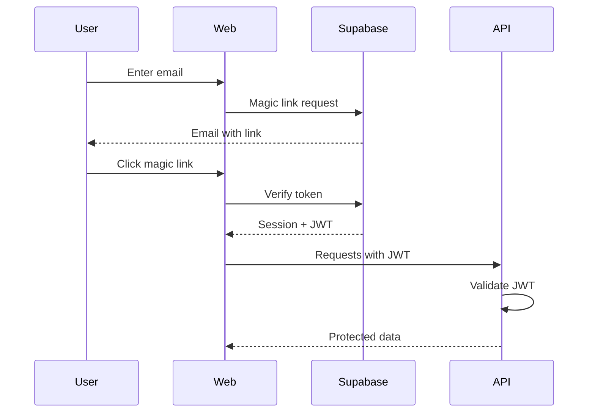

# Oratoria Architecture

This document provides a comprehensive overview of the Oratoria application architecture.

## High-Level Overview

Oratoria is a voice-first German learning platform built as a monorepo with distinct frontend and backend services.



## Technology Stack

| Layer | Technology | Purpose |
|-------|------------|---------|
| Frontend | Next.js 14 (App Router) | React framework with SSR/SSG |
| Backend | NestJS | Modular Node.js API framework |
| Database | PostgreSQL + pgvector | Relational DB with vector search |
| Cache/Queue | Redis + Bull | Job queues and caching |
| Auth | Supabase | Authentication and user management |
| AI | Google Gemini | Speech analysis and feedback |
| Monorepo | pnpm workspaces | Package management |

---

## Monorepo Structure

```
/Oratoria
├── apps/
│   ├── web/                 # Next.js frontend application
│   │   ├── src/
│   │   │   ├── app/         # App Router pages and layouts
│   │   │   ├── components/  # Reusable React components
│   │   │   └── lib/         # Utilities, hooks, and configs
│   │   └── public/          # Static assets
│   │
│   └── api/                 # NestJS backend API
│       └── src/
│           ├── auth/        # Authentication module
│           ├── user/        # User management
│           ├── lesson/      # Lesson content and flow
│           ├── speak/       # Voice recording handling
│           ├── analysis/    # AI-powered speech analysis
│           ├── srs/         # Spaced repetition system
│           ├── placement/   # Placement test logic
│           ├── rag/         # RAG for grammar explanations
│           ├── ai-adapter/  # Gemini API integration
│           ├── notifications/ # Push/email notifications
│           └── prisma/      # Database client
│
└── packages/
    ├── ui/                  # Shared React components
    ├── lib/                 # Shared TypeScript types
    └── migrations/          # Prisma schema and migrations
```

---

## Backend Modules

The NestJS backend is organized into feature modules:

### Core Modules

| Module | Purpose |
|--------|---------|
| `PrismaModule` | Database connection and ORM |
| `AuthModule` | JWT authentication, guards |
| `UserModule` | User CRUD operations |

### Feature Modules

| Module | Purpose |
|--------|---------|
| `LessonModule` | Lesson content, phases, progress |
| `SpeakModule` | Audio upload, transcription |
| `AnalysisModule` | Pronunciation/grammar analysis |
| `SrsModule` | Spaced repetition scheduling |
| `PlacementModule` | Initial level assessment |
| `RagModule` | Vector search for grammar rules |
| `AiAdapterModule` | Gemini API wrapper |
| `NotificationsModule` | Email/push notifications |

### Module Interaction Flow



---

## Frontend Architecture

### App Router Pages

| Route | Description |
|-------|-------------|
| `/` | Landing page |
| `/auth` | Login/signup |
| `/onboarding/*` | Multi-step onboarding flow |
| `/learn` | Learning dashboard |
| `/lesson/[id]` | Individual lesson view |
| `/review` | SRS review queue |
| `/speak` | Free speaking practice |
| `/roleplay` | Scenario-based conversations |
| `/progress` | Statistics and achievements |
| `/profile` | User profile |
| `/settings` | App preferences |

### Component Architecture

```
src/components/
├── AppLayout.tsx      # Main layout with sidebar
├── Sidebar.tsx        # Navigation sidebar
├── ui/                # Shared UI primitives
└── [feature]/         # Feature-specific components
```

### State Management

- **Server State**: React Query / Server Components
- **Auth State**: Context API (`AuthProvider`)
- **Local UI State**: React hooks (`useState`, `useReducer`)

---

## Data Flow

### Learning Loop



1. **Input**: User sees/hears German content
2. **Recall**: Prompted to remember vocabulary/grammar
3. **Output**: User speaks in German
4. **Feedback**: AI analyzes pronunciation/grammar
5. **SRS Update**: Algorithm schedules next review

### Authentication Flow



---

## Database Schema

Core tables managed by Prisma:

| Table | Purpose |
|-------|---------|
| `User` | User profiles and preferences |
| `Lesson` | Learning content |
| `UserLesson` | User-lesson relationship/progress |
| `Recording` | Voice recordings metadata |
| `SrsItem` | Spaced repetition cards |
| `Review` | Review history |

### Vector Storage

PostgreSQL with pgvector extension enables:
- Semantic search for grammar rules
- Similar sentence finding
- RAG-based explanations

---

## Security

- **Authentication**: Supabase Auth with JWT
- **API Protection**: NestJS Guards
- **CORS**: Configured for frontend origins
- **Rate Limiting**: Planned via Redis
- **Data Privacy**: GDPR-compliant voice data deletion

---

## Deployment

### Development

```bash
# Start all services
docker compose up -d   # PostgreSQL + Redis
pnpm dev               # Frontend + Backend
```

### Production

- **Frontend**: Vercel
- **Backend**: Railway/Render
- **Database**: Supabase or managed PostgreSQL
- **Redis**: Upstash

---

## Future Considerations

- [ ] Offline mode with service workers
- [ ] Mobile apps (React Native)
- [ ] Real-time collaboration features
- [ ] Advanced analytics dashboard
- [ ] Multi-language support beyond German
