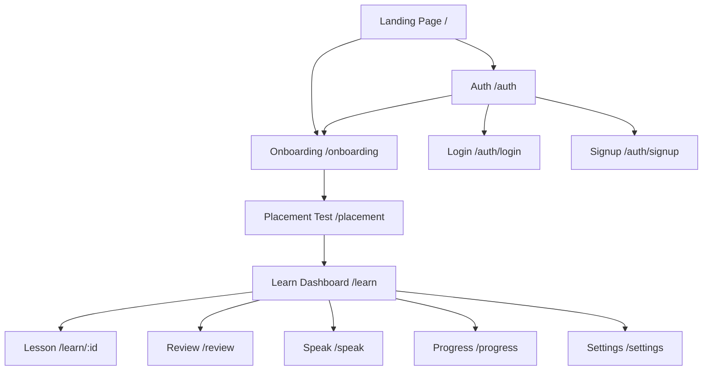

# Oratoria Website Structure & User Flows

Complete documentation of the Oratoria German learning application.

---

## 📁 Site Map



---

## 1. Landing Page (`/`)

### Purpose
Marketing homepage to attract new users and explain the value proposition.

### Sections
| Section | Content |
|---------|---------|
| **Header** | Logo, "Log in" link, "Start Learning" CTA button |
| **Hero** | Main headline, tagline, "Start Free" CTA |
| **How It Works** | 3-step cards (Goal → Practice → Progress) |
| **What We Don't Do** | Differentiation statements |
| **Testimonials** | 2 user quotes |
| **Final CTA** | "Begin Free" button |
| **Footer** | Privacy, Terms, Contact links |

### Buttons & Actions
| Button | Action |
|--------|--------|
| **Log in** | Navigate to `/auth` |
| **Start Learning** | Navigate to `/onboarding` |
| **Start Free** | Navigate to `/onboarding` |
| **Begin Free** | Navigate to `/onboarding` |

---

## 2. Authentication (`/auth`)

### Purpose
User login and signup with email/password or magic link.

### Features
- **Mode Toggle**: Switch between Login and Signup
- **Form Fields**: Email, Password, Name (signup only)
- **Magic Link**: Passwordless login option
- **Redirect Support**: `?redirect=` query param

### Buttons & Actions
| Button | Action |
|--------|--------|
| **Log in** / **Create account** | Submit form, redirect to `/learn` |
| **Send magic link** | Sends email, shows confirmation |
| **Already have account?** | Link to login mode |
| **Create one** | Link to signup mode |

### Sub-routes
- `/auth/login` - Dedicated login page
- `/auth/signup` - Dedicated signup page
- `/auth/callback` - OAuth callback handler

---

## 3. Onboarding (`/onboarding`)

### Purpose
Multi-step wizard to personalize the learning experience.

### Steps (5 total)
| Step | Screen | Inputs |
|------|--------|--------|
| 1 | Welcome | Continue button |
| 2 | Goal Selection | Radio: Work, Integration, Exam, Everyday |
| 3 | Time Commitment | Radio: 10/15/30 min per day |
| 4 | Language Background | Dropdown: Native language, Checkbox: Prior German study |
| 5 | Ready for Placement | Microphone info, Start button |

### Buttons & Actions
| Button | Action |
|--------|--------|
| **Continue** / **Next** | Advance to next step |
| **Back** | Return to previous step |
| **Run placement** | Save data, navigate to `/placement` |
| **Already have account?** | Navigate to `/auth/login` |

---

## 4. Placement Test (`/placement`)

### Purpose
5-minute voice-based assessment to determine user's German level.

### Features
- **3 Speaking Prompts**: Progressive difficulty
- **Voice Recording**: Uses Web Speech API
- **AI Analysis**: Determines A1-C2 level
- **Confidence Score**: High/Low confidence indicator

### Prompts
1. *"Bitte stellen Sie sich vor..."* (Introduce yourself)
2. *"Was machen Sie beruflich?"* (Your profession)
3. *"Was sind Ihre Hobbys?"* (Your hobbies)

### Buttons & Actions
| Button | Action |
|--------|--------|
| **Repeat prompt** 🔊 | Replay audio prompt |
| **Record** 🎤 | Start/stop voice recording |
| **Skip prompt** | Skip current question |
| **Start learning** | Complete test, go to `/learn` |
| **Retry placement** | Reset and start over |

---

## 5. Learn Dashboard (`/learn`)

### Purpose
Main learning hub showing today's session and quick actions.

### Sections
| Section | Content |
|---------|---------|
| **Header** | Greeting message |
| **Session Card** | 30-min session breakdown, Start button |
| **Quick Actions** | 4 action cards |
| **Priority Notice** | Shown if 50+ pending reviews |

### Quick Action Cards
| Card | Icon | Destination |
|------|------|-------------|
| Review | 📚 | `/review` |
| Speak now | 🎤 | `/speak` |
| Progress | 📊 | `/progress` |
| Settings | ⚙️ | `/settings` |

### Buttons & Actions
| Button | Action |
|--------|--------|
| **Start session** | Navigate to `/learn/:lessonId` |
| **Start review now** | Navigate to `/review` |
| **Later** | Dismiss notice |

---

## 6. Lesson View (`/learn/[lessonId]`)

### Purpose
Individual lesson with multiple learning phases.

### Phases
1. **Dialogue** - Read/listen to conversation
2. **Pronunciation** - Practice speaking
3. **Grammar** - Learn rule, see examples
4. **Speaking** - Free practice
5. **Quiz** - Test comprehension

### Components
- Audio player with playback controls
- Voice recording control
- Progress indicator
- Feedback display

---

## 7. Review (`/review`)

### Purpose
Spaced Repetition System (SRS) for vocabulary and grammar review.

### Features
- **Item Types**: Vocabulary, Grammar patterns, Sentences
- **Self-Judgment**: Rate recall (Again, Hard, Good, Easy)
- **Voice Practice**: Speak answers aloud
- **Progress Tracking**: Items reviewed, queue count

### Buttons & Actions
| Button | Action |
|--------|--------|
| **Show answer** | Reveal answer |
| **Again** | Mark as failed, short interval |
| **Hard** | Mark as difficult |
| **Good** | Mark as recalled |
| **Easy** | Mark as easy, long interval |
| **← Back** | Return to `/learn` |

---

## 8. Speaking Practice (`/speak`)

### Purpose
Scenario-based speaking practice with AI feedback.

### Scenarios (by level)
| Level | Scenario | Prompt |
|-------|----------|--------|
| A1 | Café | Order coffee and sandwich |
| A1 | Train station | Ask for ticket to Munich |
| A2 | Doctor's office | Describe how you feel |
| B1 | Job interview | Introduce yourself professionally |

### Buttons & Actions
| Button | Action |
|--------|--------|
| **Scenario dropdown** | Select practice scenario |
| **Record** 🎤 | Start speaking |
| **Try again** | Reset and re-record |
| **Accept** | Save response, get full analysis |
| **← Back** | Return to `/learn` |

---

## 9. Progress & Diagnostics (`/progress`)

### Purpose
View learning progress and performance metrics.

### Metrics Displayed
| Category | Metrics |
|----------|---------|
| **Level** | Current CEFR level (A1-C2) |
| **Speaking** | Clarity %, Sessions completed |
| **Grammar** | Patterns learned |
| **Vocabulary** | Words learned |

### Suggested Actions
- Complete pending reviews
- Do targeted pronunciation practice

### Buttons & Actions
| Button | Action |
|--------|--------|
| **Do 3 speaking samples** | Navigate to `/speak` |
| **Pending reviews** | Navigate to `/review` |
| **← Back** | Return to `/learn` |

---

## 10. Settings (`/settings`)

### Purpose
User preferences and account management.

### Preference Options
| Setting | Options |
|---------|---------|
| **Correction Depth** | Minimal, Standard, Full |
| **Correction Timing** | Immediate, Summary |
| **Time Commitment** | 10, 15, 30 min/day |

### Account Actions
| Action | Description |
|--------|-------------|
| **Save** | Save preference changes |
| **Delete voice data** | GDPR compliance (with confirmation) |
| **Log out** | Sign out, redirect to `/` |

---

## 🔄 Primary User Flows

### New User Flow
```
1. Landing → 2. Start Learning → 3. Onboarding (5 steps)
→ 4. Placement Test → 5. Learn Dashboard
```

### Returning User Flow
```
1. Landing → 2. Log in → 3. Auth → 4. Learn Dashboard
```

### Daily Learning Flow
```
1. Dashboard → 2. Start Session → 3. Lesson Phases
→ 4. Complete → 5. Back to Dashboard
```

### Review Flow
```
1. Dashboard → 2. Review → 3. Answer Cards
→ 4. Self-Judgment → 5. Complete → 6. Dashboard
```

---

## 🧩 Shared Components

| Component | Used In | Purpose |
|-----------|---------|---------|
| `Button` | All pages | Styled CTA buttons |
| `RecordControl` | Placement, Speak, Review, Lessons | Voice recording |
| `AudioPlayer` | Lessons | Playback audio files |

---

## 🔐 Protected Routes

Routes requiring authentication (handled by middleware):
- `/learn/*`
- `/progress`
- `/review`
- `/speak`
- `/settings`

Unauthenticated users are redirected to `/auth?redirect=<original_path>`
